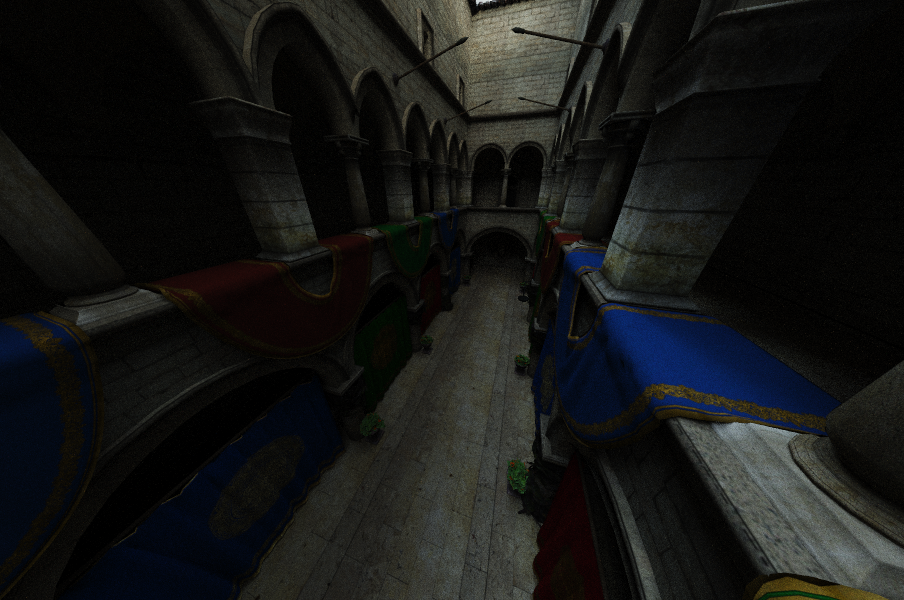
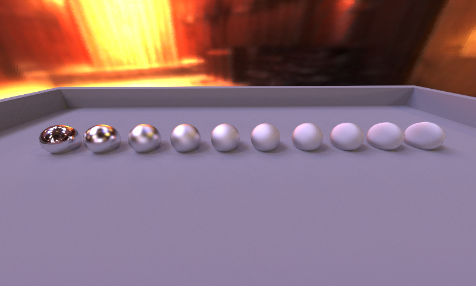

# CUDA Pathtracer




## Features

### GPU implementation
The Pathtracer was implemented on the GPU using Cuda. 
I have implemented it using two different techniques, Megakernel vs Wavefront, for comparison purposes.
Both implementations supports basic triangle intersection, texture mapping, triangle lights, scene traversal using an MBVH, and 3 types of materials/BRDFS (diffuse, dielectrics, and glossy).
For the Wavefront Pathtracer the different types of materials are implemented in different kernels.

Rays are generated with coherence in mind when using the Wavefront approach. Instead of simply assigning each consecutive thread a consecutive pixel index in the frame buffer, every 32 threads (size of a warp) gets assigned an 8x4 block of pixels. This increases coherence for primary Rays, which slightly improves frame times.

### Importance Sampling
Various forms of importance sampling were implemented.
The BRDF for Diffuse materials is importance sampled using a cosine weighted distribution. 
The BRDF for Glossy materials is importance sampled using the technique described in Walter et al. 2007.
Next Event estimtation is used by Diffuse and Glossy materials. 
Multiple Importance Sampling is used by Diffuse and Glossy materials.

### Microfacet Materials



Glossy materials are implemented using the Beckmann microfacet model.
Glossy materials also use NEE and MIS.
When tracing non-shadow rays (i.e. looking for indirect light) the BRDF is importance sampled using the formulas described in Walter et al. 2007.

### MBVH
A 4-way MBVH is constructed by collapsing a binary SBVH. The collapsing procedure was implemented as described in the slides. The MBVH results in a big speedup on larger scenes. Sponza went from ~180 ms to ~100 ms per frame! But smaller scenes also benefit, Scene.obj went from ~50 ms to ~40 ms.

## MegaKernel vs Wavefront
Timings for different scenes:

| Scene     |  Triangle count |  Average time using Wavefront |  Average time using MegaKernel |
|-----------|-----------------|-------------------------------|--------------------------------|
| Scene.obj |  2681           |  44 ms                        |  49 ms                         |
| Sponza    |  262205         |  102 ms                       |  156 ms                        |
| Gallery   |  998941         |  282 ms                       |  307 ms                        |

The Scene.obj scene contains all instances of the three different supported material types, the other two scenes contain only diffuse materials.
This means we can conclude that the Wavefront not only helps in cases where we have to deal with lots of different materials, but also in the simplest case of a uniformly diffuse scene.

You can switch between using the MegaKernel / Wavefront approach by changing the ```PATH_TRACER``` define in Main.cpp to either ```MegaKernel``` or ```Wavefront```.

## Scenes
You can change what scene is being used by changing the ```scene_filename``` variable on line 34 of Main.cpp. Valid options are:
- ```sponza/sponza.obj``` - Sponza scene, can be used to test performance.
- ```scene.obj``` - Custom test scene, can be used to check the various materials.
- ```glossy.obj``` - Custom test scene, shows spheres with varying degrees of roughness.

You can also check the Screenshots subfolder for various examples of the materials etc.

## Papers
- Megakernels Considered Harmful: Wavefront Path Tracing on GPUs - Laine et al.
- Microfacet Models for Refraction through Rough Surfaces - Walter et al.

## Dependencies

The project uses SDL and GLEW. Their dll's for both x86 and x64 targets are included in the repositories, as well as all required headers.

The project is dependent on CUDA 10.2 and requires that the ```CUDA_PATH``` system variable is set to the path where CUDA 10.2 is installed.
