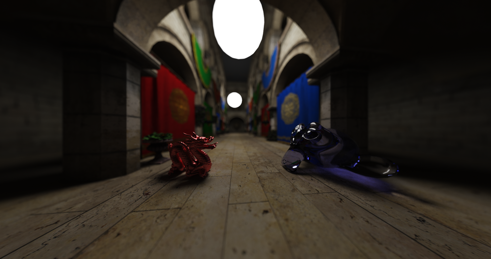
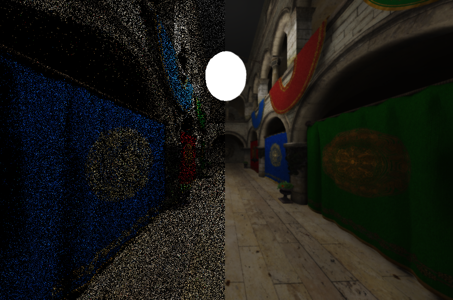

# CUDA Pathtracer



Interactive CUDA pathtracer that implements a variety of rendering techniques. 

## Features

- Wavefront rendering, see [Laine et al. 2013](https://research.nvidia.com/sites/default/files/pubs/2013-07_Megakernels-Considered-Harmful/laine2013hpg_paper.pdf)
- Multiple BVH types
  - Standard binary SAH-based BVH
  - SBVH (Spatial BVH), see [Stich et al. 2009](https://www.nvidia.in/docs/IO/77714/sbvh.pdf). This BVH is able to split across triangles.
  - QBVH (Quaternary BVH). The QBVH is a four-way BVH that is constructed by iteratively collapsing the Nodes of the SBVH. The collapsing procedure was implemented as described in [Wald et al. 2008](https://graphics.stanford.edu/~boulos/papers/multi_rt08.pdf).
  - CWBVH (Compressed Wide BVH), see [Ylitie et al. 2017](https://research.nvidia.com/sites/default/files/publications/ylitie2017hpg-paper.pdf). Eight-way BVH that is constructed by collapsing the SBVH. Each BVH Node is compressed so that it takes up only 80 bytes per node. The implementation incudes the Dynamic Fetch Heurisic as well as Triangle Postponing (see paper). The CWBVH outperforms all other BVH types.
  - All BVH types use Dynamic Ray Fetching to reduce divergence among threads, see [Aila et al. 2009](https://www.nvidia.com/docs/IO/76976/HPG2009-Trace-Efficiency.pdf)
- Two Level Acceleration Structures
  - BVH's are split into two parts, at the world level (TLAS) and at the model level (BLAS). This allows dynamic scenes with moving Meshes as well as Mesh instancing where multiple meshes with different transforms share the same underlying triangle/BVH data.
- SVGF (Spatio-Temporal Variance Guided Filter), see [Schied et al](https://cg.ivd.kit.edu/publications/2017/svgf/svgf_preprint.pdf). Denoising filter that allows for noise-free images at interactive framerates. Also includes a TAA pass.
- Importance Sampling
  - Next Event Estimation (NEE): Shadow rays are explicitly aimed at light sources to reduce variance.
  - Multiple Importance Sampling (MIS): Explicit light sampling (NEE) is combined with standard BRDF sampling using MIS to get the best of both.
  - Cosine weighted direction sampling for diffuse bounces.
  - Microfacet sampling as described in [Walter et al. 2007](https://www.cs.cornell.edu/~srm/publications/EGSR07-btdf.pdf)
- Blue Noise Sampling: The low discrepency sampler by [Heitz et al.](https://eheitzresearch.wordpress.com/762-2/) is used. This sampler distributes Monte Carlo errors as a blue noise in screen space.
- Primary Ray Rasterization: For efficiency reasons primary rays are rasterized using OpenGL, before being propagated further as bounced rays in CUDA.
- Multiple Material types
  - Diffuse
  - Dielectrics
  - Microfacets (Beckmann and GGX, configurable)

## Screenshots


SVGF: Raw output of the pathtracer on the left and the filtered result on the right.


Glossy spheres with varying roughness.

## Usage

Camera can be controlled with WASD for movement and the arrow keys for orientation. Shift and space do vertical movement.
Various configurable options are available in `Common.h`.

## Dependencies

The project uses SDL and GLEW. Their dll's for x64 are included in the repository, as well as all required headers.

The project uses CUDA 11.0 and requires that the ```CUDA_PATH``` system variable is set to the path where the CUDA 11.0 SDK is installed.
