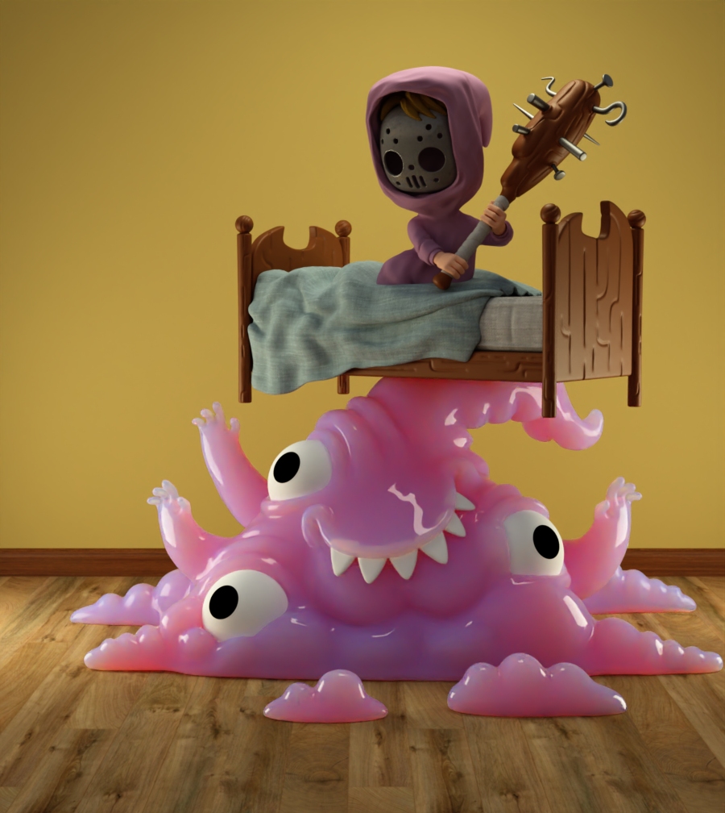

# CUDA Pathtracer




Interactive CUDA pathtracer that implements a variety of rendering techniques. 

## Features

- Wavefront rendering, see [Laine et al. 2013](https://research.nvidia.com/sites/default/files/pubs/2013-07_Megakernels-Considered-Harmful/laine2013hpg_paper.pdf)
- Multiple BVH types
  - Standard binary *SAH-based BVH*
  - *SBVH* (Spatial BVH), see [Stich et al. 2009](https://www.nvidia.in/docs/IO/77714/sbvh.pdf). This BVH is able to split across triangles.
  - *BVH4* (Quaternary BVH). The BVH4 is a four-way BVH that is constructed by iteratively collapsing the Nodes of a binary BVH. The collapsing procedure was implemented as described in [Wald et al. 2008](https://graphics.stanford.edu/~boulos/papers/multi_rt08.pdf).
  - *BVH8* (Compressed Wide BVH), see [Ylitie et al. 2017](https://research.nvidia.com/sites/default/files/publications/ylitie2017hpg-paper.pdf). Eight-way BVH that is constructed by collapsing a binary BVH. Each BVH Node is compressed so that it takes up only 80 bytes per node. The implementation incudes the Dynamic Fetch Heurisic as well as Triangle Postponing (see paper). The BVH8 outperforms all other BVH types.
  - BVH Optimization. The SAH cost of binary BVH's can be optimized using a method by [Bittner et al. 2012](https://dspace.cvut.cz/bitstream/handle/10467/15603/2013-Fast-Insertion-Based-Optimization-of-Bounding-Volume-Hierarchies.pdf).
  - All BVH types use Dynamic Ray Fetching to reduce divergence among threads, see [Aila et al. 2009](https://www.nvidia.com/docs/IO/76976/HPG2009-Trace-Efficiency.pdf)
- Two Level Acceleration Structures
  - BVH's are split into two parts, at the world level (TLAS) and at the model level (BLAS). This allows dynamic scenes with moving Meshes as well as Mesh instancing where multiple meshes with different transforms share the same underlying triangle/BVH data.
- *SVGF* (Spatio-Temporal Variance Guided Filter), see [Schied et al](https://cg.ivd.kit.edu/publications/2017/svgf/svgf_preprint.pdf). Denoising filter that allows for noise-free images at interactive framerates. Also includes a TAA pass.
- Participating Media (homogeneous)
  - Intuitive, artist friendly parameters: Instead of the usual σ<sub>a</sub> and σ<sub>s</sub> parameters the more intuitive A (albedo) and d (distance) parameters are used (see [Chiang et al.](https://dl-acm-org.proxy.library.uu.nl/doi/10.1145/2897839.2927433)) 
  - Multiple Importance Sampling* (MIS): Sample scattering distance for each wavelength using MIS (see [Wrenninge et al.](https://graphics.pixar.com/library/PathTracedSubsurface/paper.pdf))
- Importance Sampling
  - *Next Event Estimation* (NEE): Shadow rays are explicitly aimed at light sources to reduce variance.
  - *Multiple Importance Sampling* (MIS): Explicit light sampling (NEE) is combined with standard BRDF sampling using MIS to get the best of both.
  - Cosine weighted direction sampling for diffuse bounces.
  - Microfacet sampling as described in [Heitz 2018](http://jcgt.org/published/0007/04/01/)
- *Mipmapping*: Textures are sampled using mipmapping. Mipmap sampling is done using ray cones (see [Möller et al. 2012](http://www.jcgt.org/published/0010/01/01/), [Möller et al. 2019](https://media.contentapi.ea.com/content/dam/ea/seed/presentations/2019-ray-tracing-gems-chapter-20-akenine-moller-et-al.pdf)). Primary rays perform anisotropic sampling, subsequent bounces use isotropic sampling.
- *PMJ02 Sampling*: The low discrepency sampler by [Cristensen et al. 2019](https://graphics.pixar.com/library/ProgressiveMultiJitteredSampling/paper.pdf). Sequences are decorrelated using Cranley-Patterson rotations with blue noise.
- Hot Reloading: When F5 is pressed the CUDA module is recompiled from source to allow for interactive debugging and development.
- PBR Material types
  - *Diffuse* (Lambertian)
  - *Plastic* (Specular on top of diffuse)
  - *(Rough) Dielectric*
  - *(Rough) Conductor*
- Mitsuba XML Scene support: A custom Mitsuba XML parser is included to load scene files. Custom loaders for OBJ and PLY files are available.

## Screenshots


SVGF: Raw output of the pathtracer on the left and the filtered result on the right.


For more screenshots, see the Screenshots folder

## Usage

Camera can be controlled with WASD for movement and the arrow keys for orientation. Shift and space do vertical movement.
Various configurable options are available as command line arguments. Use command line option `--help` to see an up to date list.

## Dependencies

- [SDL 2](https://www.libsdl.org/)
- [GLEW](http://glew.sourceforge.net/)
- [Dear ImGui](https://github.com/ocornut/imgui)
- [Miniz](https://github.com/richgel999/miniz)
- [STB Image](https://github.com/nothings/stb)
- [STB DXT](https://github.com/nothings/stb)
- [CUDA 11.0](https://developer.nvidia.com/cuda-11.0-download-archive)

All dependecies (headers, libs, and dlls) except CUDA 11.0 are included in the repository.
The project requires that the ```CUDA_PATH``` system variable is set to the path where the CUDA SDK is installed.

## Scene Sources

- [Morgan McGuire's OBJ scenes](https://casual-effects.com/data/)

- [Benedikt Bitterli's Mitsuba scenes](https://benedikt-bitterli.me/resources/)

- Blendswap
	- [Stormtrooper](https://www.blendswap.com/blend/13953)
	- [Candles](https://blendswap.com/blend/1845)
	- [Piano](https://blendswap.com/blend/29080)
	- [Zealot](https://blendswap.com/blend/17301)
	- [Millennium Falcon](https://blendswap.com/blend/5843)

- [Blender Demos](https://www.blender.org/download/demo-files/)

- [Luxcore Demos](https://luxcorerender.org/example-scenes/)
